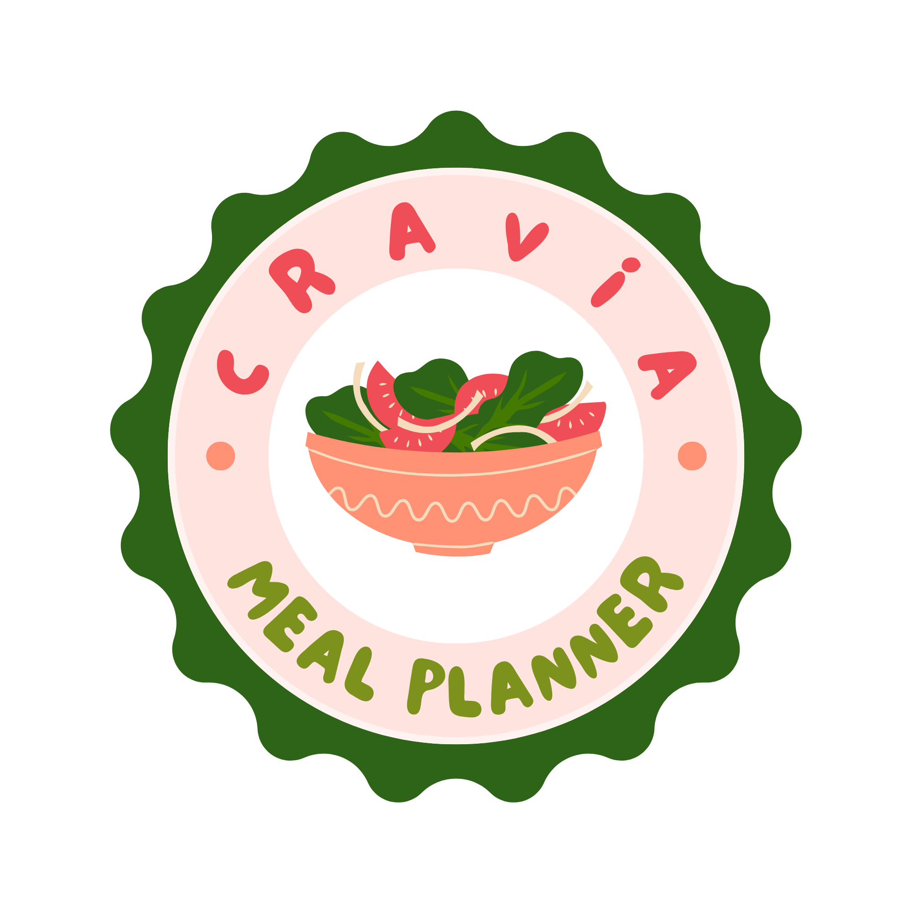

  

<h1 align="center">Cravia</h1>

<b>Snap a photo. Know your calories. Hit your goals.</b>

Cravia turns the most tedious part of tracking nutrition — logging what you eat — into a five-second photo. No searching food databases, no guessing portion sizes. Point your camera at your plate and let AI do the counting, so you can stay consistent without the chore.

## Why you'll love it

- 📸 **Snap & log in seconds** — photograph any meal and get an instant AI-powered breakdown of calories, macros, and a health score. Review and tweak before you save — you're always in control.
- 💬 **Ask AI, your nutrition coach in your pocket** — got a question about a food, a swap, or your progress? Just ask, and get a real answer, right in the app.
- 🎯 **A plan built around you** — tell us your body metrics, activity level, and goal, and Cravia calculates a personalized daily calorie and macro target — not a generic one-size-fits-all number.
- 📊 **See your progress at a glance** — a clean daily dashboard with calorie and macro rings plus a weekly strip, so you always know exactly where you stand.
- 👤 **Your plan, your way** — fine-tune your goals and macro split anytime as your journey evolves.
- 🔒 **Your data, everywhere you go** — sign in once and your meal history follows you across devices.

Whether you're cutting, bulking, or just trying to eat a little more mindfully, Cravia removes the friction so tracking actually sticks.

## Tech stack

- **Flutter** (Dart) — cross-platform mobile client, Android/iOS build flavors (dev/prod).
- **Riverpod** — state management and dependency injection.
- **go_router** — navigation.
- **Clean architecture** — domain/data/presentation layers per feature.
- **Supabase** — Postgres database, Auth, Storage.
- **Supabase Edge Functions** (Deno/TypeScript) — server-side AI orchestration.
- **Gemini** — meal photo analysis and chat responses.
- **fl_chart** — calorie/macro ring and chart visuals.
- **mocktail** — unit testing of domain use cases.